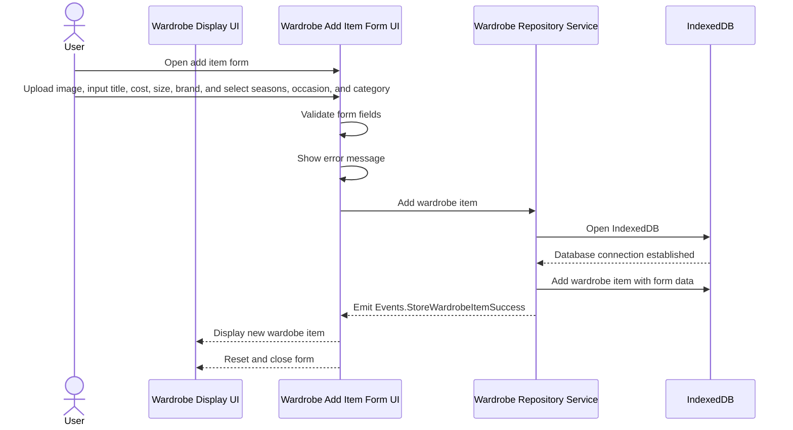

# Feature description

The add wardrobe item feature is a form that allows a user to enter a new item into their wardrobe. In the form, the user uploads an image, inputs the title, cost, size, and brand, and selects the seasons, occasion, and category. On submission, the form fields are validated and if they are valid a new wardrobe item entry is created. This entry is displayed in the wardrobe page and added to the wardrobe items in indexDB. The form is then closed and reset for the next entry,

# Sequence Diagram

