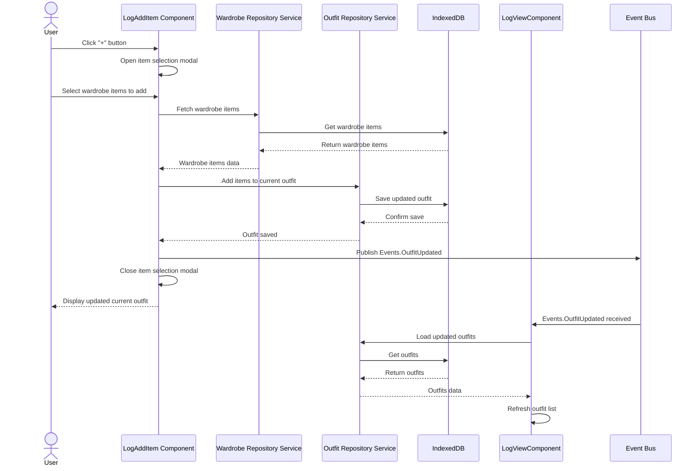
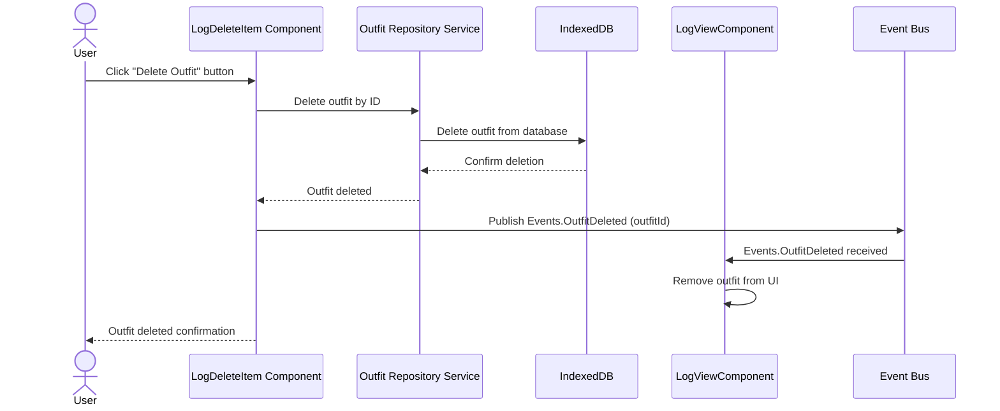

# LogAddItem Feature

The LogAddItem feature allows a user to add items from their wardrobe to their current day's outfit log. On the "Log" page, the user sees a section titled "Today I'm wearing..." with a "+" button to add items. When the user clicks the "+" button, an item selection modal opens, displaying their wardrobe items. The user selects items to add to their outfit. Upon confirmation, the selected items are added to the current outfit, which is saved to IndexedDB via the OutfitRepositoryService. The LogAddItem component publishes an Events.OutfitUpdated event to notify the LogViewComponent to refresh the outfit list. The updated outfit is displayed on the log page.

# LogDeleteItem Feature

The LogDeleteItem feature enables a user to remove an entire outfit from the outfit log. On the "Log" page, each outfit log entry has a delete button (usually labeled "Delete Outfit"). When the user clicks the delete button, the entire outfit is removed from the outfit log. The LogDeleteItem component deletes the outfit from IndexedDB via the OutfitRepositoryService and publishes an Events.OutfitDeleted event to notify the LogViewComponent to remove the outfit from the UI.

# LogAddItem Sequence Diagram

# LogDeleteItem Sequence Diagram

