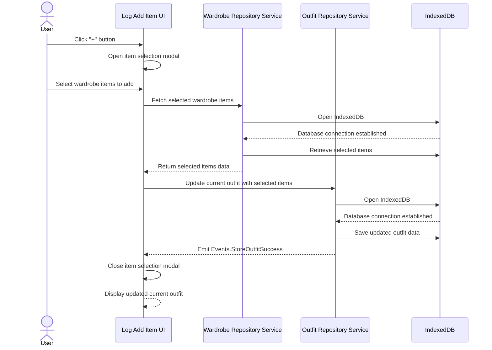
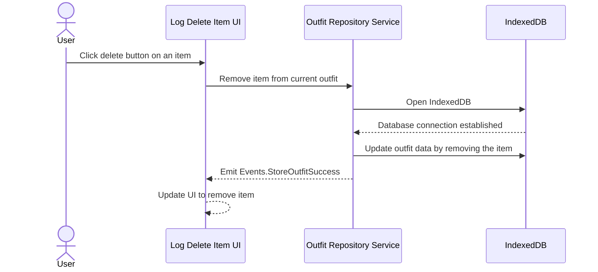

# LogAddItem Feature

The LogAddItem feature allows a user to add items from their wardrobe to their current day's outfit log. On the "Log" page, the user sees a section titled "Today I'm wearing..." with a "+" button to add items. When the user clicks the "+" button, an item selection modal opens, displaying their wardrobe items. The user selects items to add to their outfit, and upon confirmation, the selected items are added to the current outfit. The updated outfit is displayed on the log page and saved to IndexedDB via the OutfitRepositoryService.

# LogDeleteItem Feature

The LogDeleteItem feature enables a user to remove items from their current day's outfit log. On the "Log" page, each item in the current outfit has a delete button (usually an "x" or "Delete"). When the user clicks the delete button on an item, that item is removed from the current outfit. The UI updates to reflect the change, and the updated outfit is saved to IndexedDB via the OutfitRepositoryService.

# LogAddItem Sequence Diagram

# LogDeleteItem Sequence Diagram

