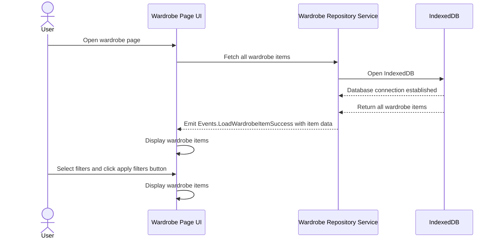

# Feature Description

The Wardrobe Page of ClosetIQ provides a search and filter feature that allows users to locate specific wardrobe items that meet the user's criteria based on the properties of the wardrobe item such as the season the item is worn in, the occasion of when the item should be worn, the name of the item, and the name of the item's brand. The user can press the Apply Filters button to filter the current wardrobe using the inputted filters.

# Sequence Diagram

